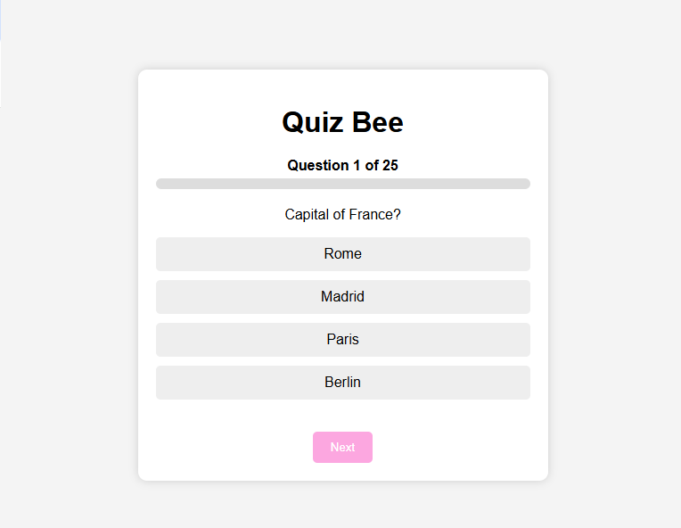
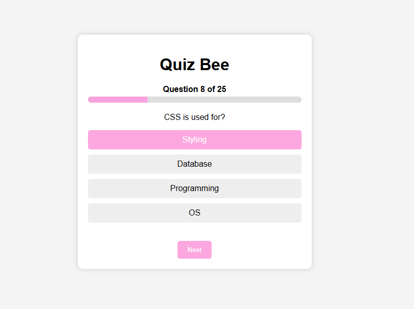
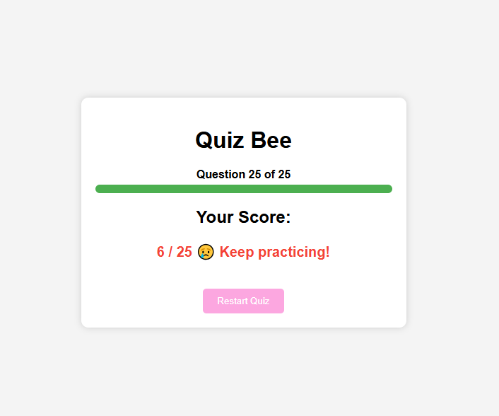

# Star Quiz Bee

Star Quiz Bee is a simple game created to stimulate gamers and create a fun but informative short game. The inspiration behind it is to be able to create an accessible game not just for an individual but for a group of people.

## Purpose

It can be used as a game to make a presentation fun, or a quiz for a class of students or even a game for a group who will get a good prize when a correct answer is achieved.

## Features

- __Randomized Questions and Options__

  - Each question is randomized and all the options in every question is randomized in every retry.
- Once a different player opens the game in a different site or the game be refreshed/restarted, it will provide a randomized set of question and options to make it more fun and interesting.
  

- ___Progress Bar___ -
  
  - Every time a player moves forward to the next question or towards the end of the game, the progress bar highlights and shows how close the gamer is to the end of the game
  

- ___End of the Game Features___
  
  - At the end of the game a score is shown which then gives a win or lose connotation.
  
  - A restart button is also provided for players who opts to reset or retry playing the game again.
  

